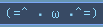

# soundcube-waves

soundcube-waves is a module for bars like waybar and polybar, that shows different animations based on soundcube status.

**Main information**

Requirements:

```
soundcube
bc
cava
```

Installation:

```
git clone https://github.com/jvc84/soundcube-waves.git
cd soundcube-waves
mkdir ~/.config/cava
cp assets/cava/cava_option_config ~/.config/cava
```

Important about CAVA:

You can configure number of bars and framerate of the option ```cava``` in ```~/.config/cava/cava_option_config```:

```
bars = <bars>
framerate = <framerate>
```

Usage:
```
 python /PATH/TO/soundcube-waves/run_soundcube_animation.py [--off OPTION] [--inactive OPTION] [--active OPTION]
```
 
**Information about Flags and Options**

Use ```python /PATH/TO/run_soundcube_animation.py --help``` to read about flags and options.


Animation flags:
```
-h, --help              -    displays information about usage, flags and options
-f, --off  OPTION    -    animation, that plays whe soundcube is down. 'cat' by default
-s, --inactive   OPTION    -    animation, that plays when soundcube is up, but music is on pause. 'flat' by default
-p, --active  OPTION    -    animation, that plays whe soundcube is up, and music is playing. 'cava' by default
```         

Options:
```
cat                 -    ASCII cat animations
info                -    'no sound'/'sound' 
splash              -    some different animations of 3 bars
waves               -    animation of 3 bars moving up and down
cava[=SECTIONS]     -    dynamic waves, that depend on sound. Requires cava
                         available SECTIONS: left, right, all. SECTIONS=all by default
                         number of bars and framerate can be defined in '$XDG_CONFIG_HOME/cava/cava_option_config'
empty[=NUM]         -    shows NUM spaces. NUM=0 by default
flat[=NUM]          -    shows NUM '▁'. NUM=16 by default

```

**Examples**

If you just want to see cava:


```
python /PATH/TO/run_soundcube_animation.py --off cava --inactive cava --active cava
```

If you want mini waves to move when music is on:


```
python /PATH/TO/run_soundcube_animation.py --off flat=3 --inactive splash --active waves
```

If you want to separate left and right cava halves to put something in between:


- module for left audio channel:

```
python /PATH/TO/run_soundcube_animation.py --off info --inactive flat=8 --active cava=left
```

- some other modules

- module for right audio channel:

```
python /PATH/TO/run_soundcube_animation.py --off flat=8 --inactive flat=8 --active cava=right
```

Maybe you just want a little cat to live in your bar:  



```
python /PATH/TO/run_soundcube_animation.py --off cat --inactive cat --active cat
```

That's pretty much it. Put star if you like this module and send bug report if something is wrong.

(=^ > ω <^=) :two_hearts:

